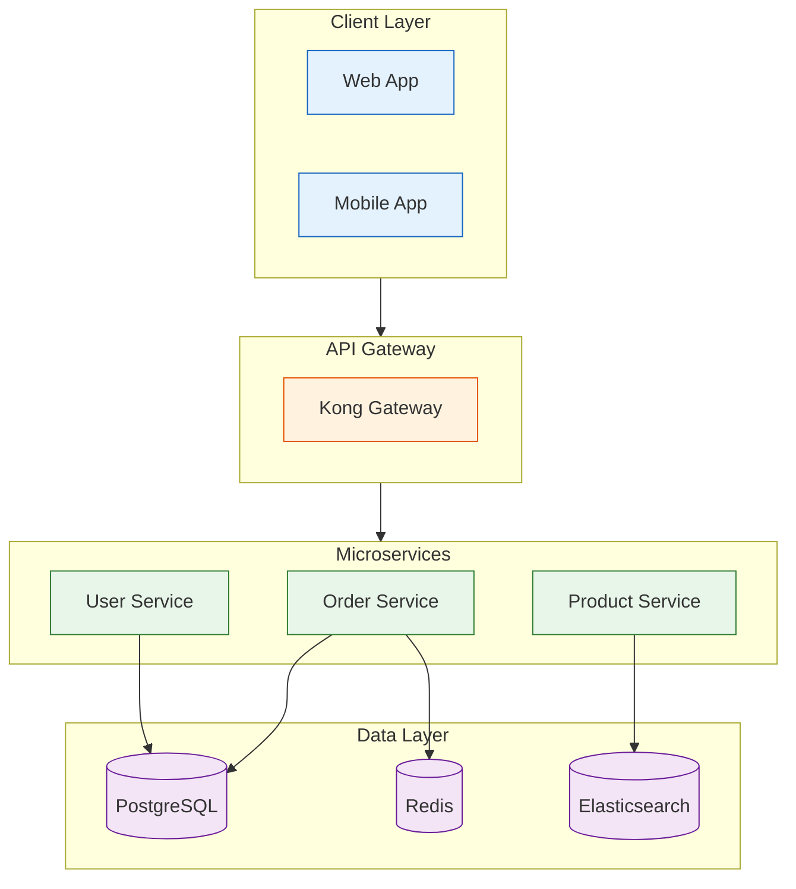
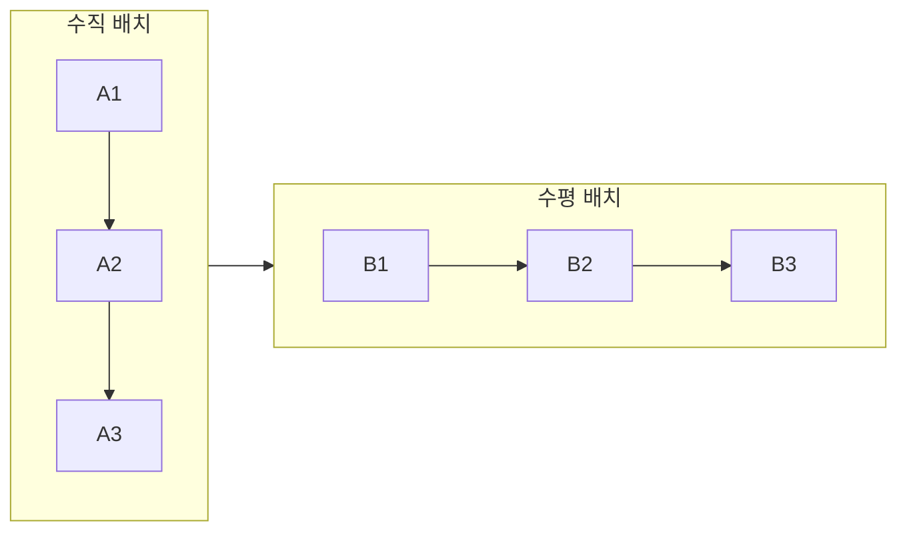
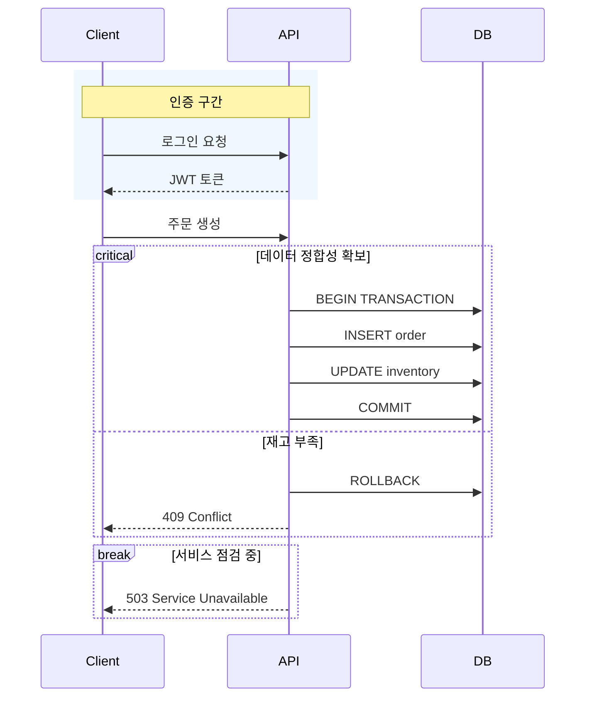
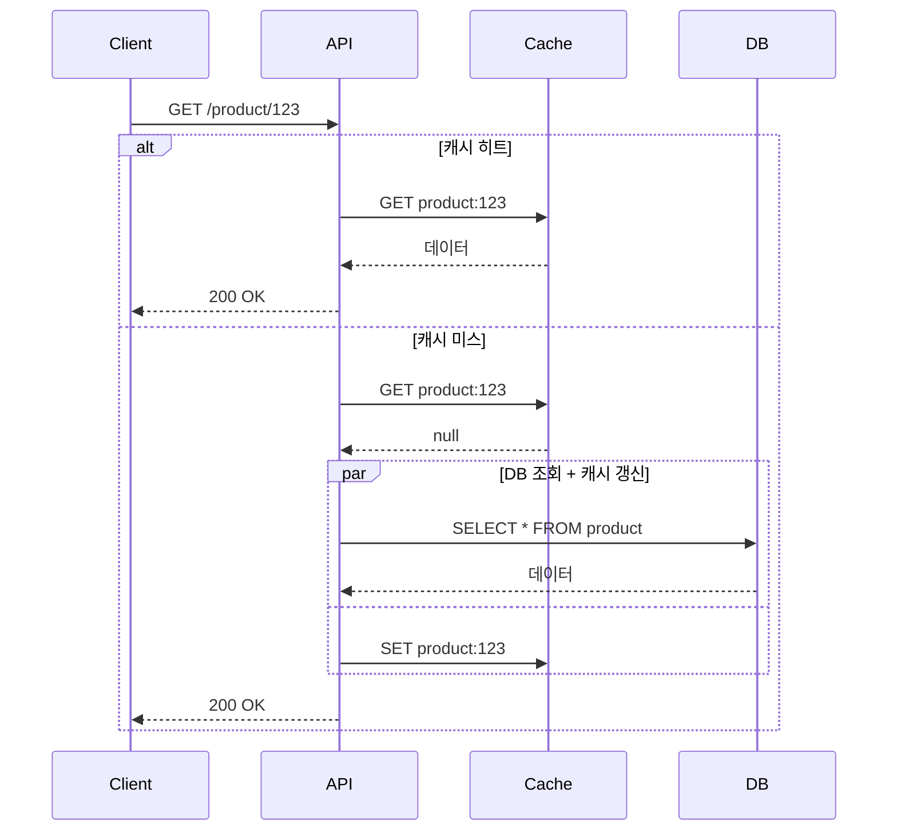
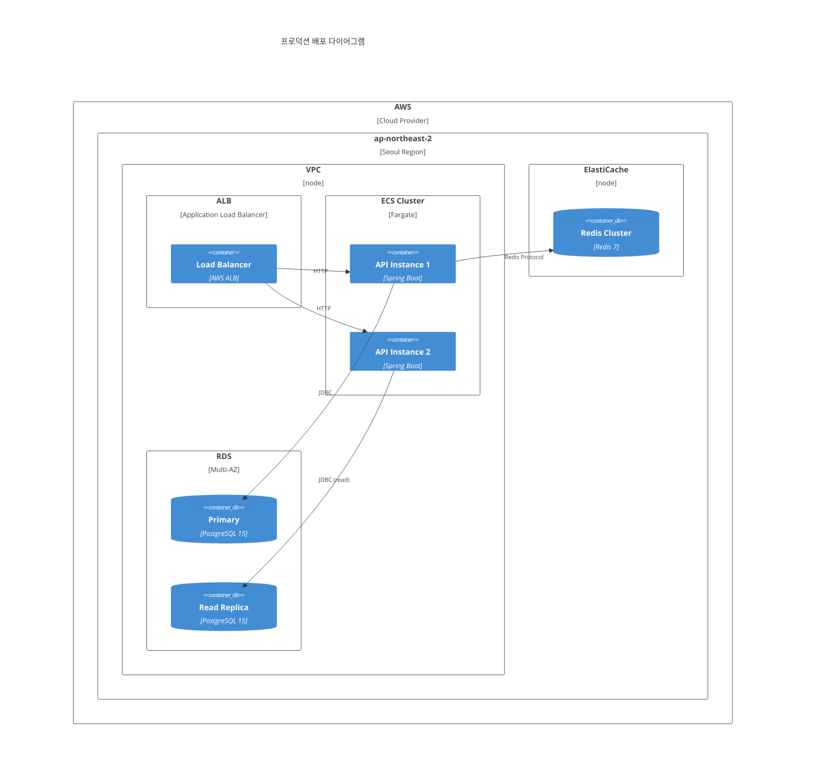
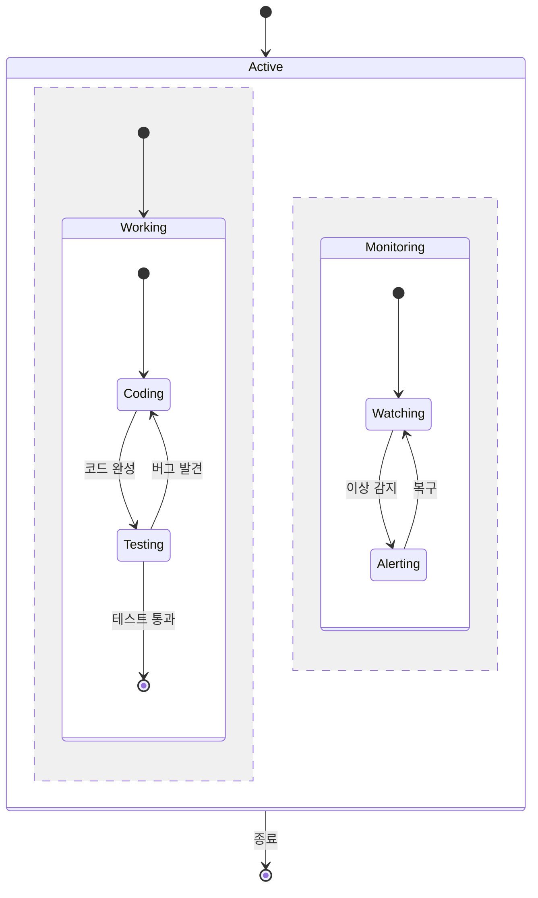
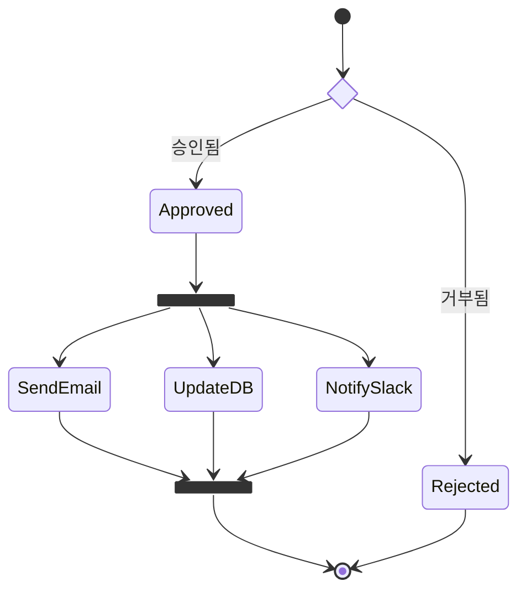
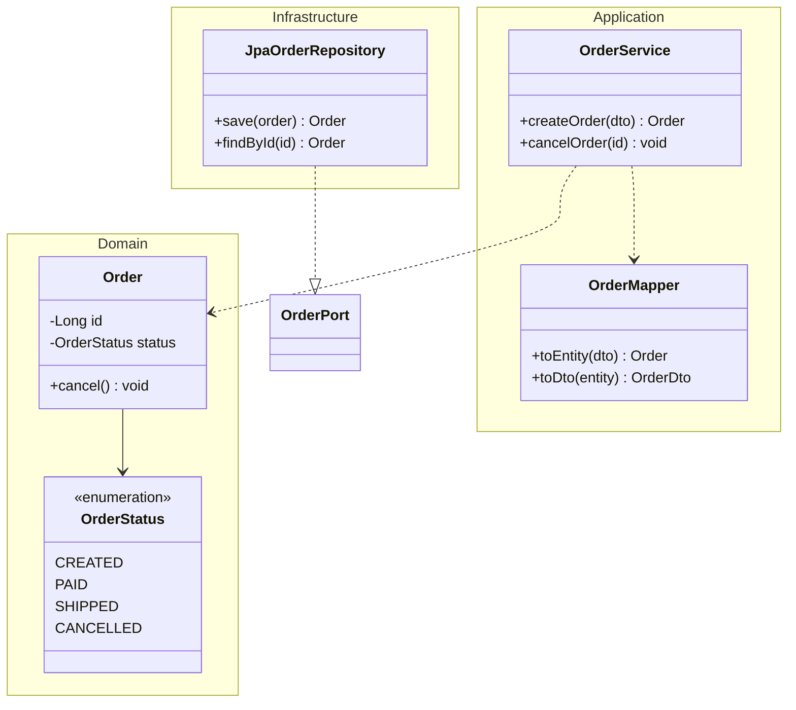
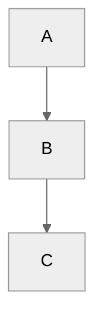
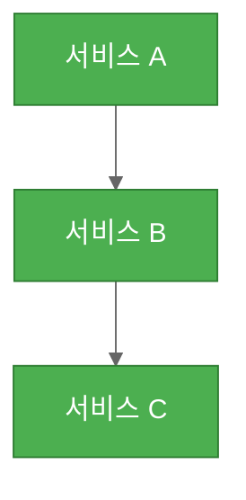

# 고급 다이어그램 기법

## 복합 다이어그램 전략

시스템 문서화 시 다이어그램을 단계적으로 조합한다:

```
1. C4 Context      → 전체 그림 (누가 무엇과 통신하는지)
2. C4 Container    → 시스템 내부 구조 (어떤 서비스가 있는지)
3. Sequence        → 핵심 흐름 (어떤 순서로 동작하는지)
4. Class / ER      → 상세 구조 (데이터가 어떻게 생겼는지)
5. State           → 상태 변화 (엔티티가 어떻게 변하는지)
6. Flowchart       → 비즈니스 규칙 (분기 조건이 무엇인지)
```

---

## 고급 Flowchart 기법

### Subgraph + 스타일링



### 스타일 정의 문법

```
classDef 스타일명 fill:#색상,stroke:#색상,stroke-width:2px,color:#텍스트색
class 노드1,노드2 스타일명
```

주요 속성: `fill`(배경), `stroke`(테두리), `stroke-width`(두께), `color`(텍스트), `stroke-dasharray`(점선)

### Subgraph 방향 제어



`direction` 키워드로 subgraph 내부 방향을 독립 제어 가능

---

## 고급 Sequence Diagram 기법

### Critical / Break / Rect



### 병렬 + 중첩



### 참가자 별칭 및 Actor 타입

```
actor User                          # 사람 아이콘
participant API as "API Server"     # 별칭 사용
participant DB as "Database"
create participant Worker           # 동적 생성
destroy Worker                      # 동적 제거
```

---

## 고급 C4 기법

### C4 Deployment (인프라 구성)



### C4 관계 스타일링

```
Rel(from, to, "라벨", "프로토콜")
BiRel(a, b, "양방향 통신")
UpdateRelStyle(from, to, $textColor="blue", $lineColor="blue", $offsetY="-10")
```

---

## 고급 State Diagram 기법

### 병렬 상태 (Concurrent States)



`--` 구분선으로 병렬 영역을 분리

### Choice / Fork / Join



---

## 고급 Class Diagram 기법

### 네임스페이스 / 패키지



### 제네릭과 추상 클래스

```
class Repository~T~ {
    <<abstract>>
    +save(entity T) T
    +findById(id Long) T
    +delete(entity T) void
}
```

`~T~`로 제네릭 표현 (꺾쇠 대신 물결표)

---

## 테마와 스타일링

### 전역 테마 설정



사용 가능 테마: `default`, `neutral`, `dark`, `forest`, `base`

### 커스텀 설정



### 개별 노드 스타일

```
style 노드ID fill:#색상,stroke:#색상,stroke-width:2px
```

### 링크(화살표) 스타일

```
linkStyle 0 stroke:#ff0000,stroke-width:2px
linkStyle default stroke:#333,stroke-width:1px
```

`linkStyle N`에서 N은 화살표의 순서 (0부터 시작, 등장 순서대로)

---

## 다이어그램 크기 관리 팁

1. **한 다이어그램에 노드 15개 이하** 유지 - 초과 시 분할
2. **subgraph로 시각적 그루핑** - 관련 노드를 묶어 가독성 확보
3. **상세도는 단계적으로** - C4 Context → Container → Component 순으로 확대
4. **레이블은 간결하게** - 노드에 상세 설명 대신 핵심 키워드만
5. **방향은 일관되게** - 한 다이어그램 내 데이터 흐름 방향 통일
