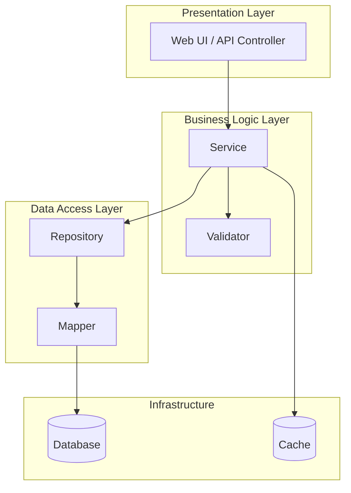
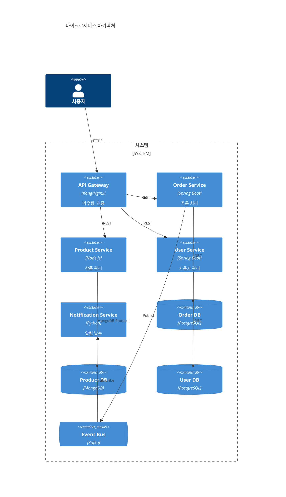
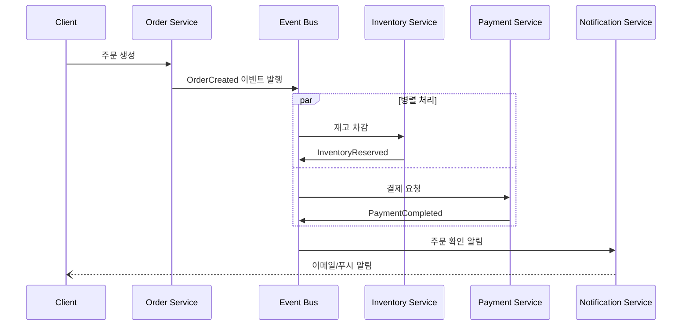
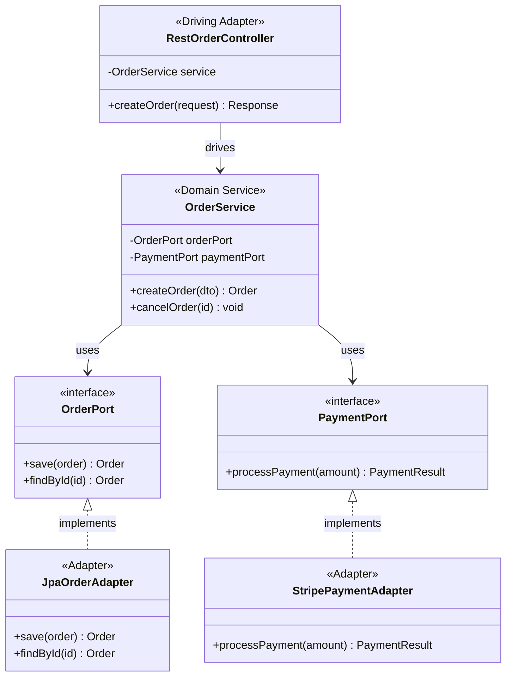
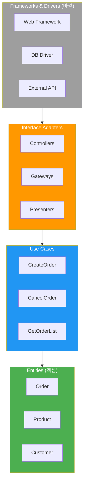
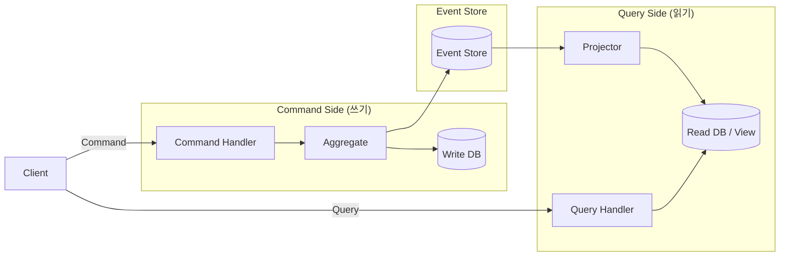
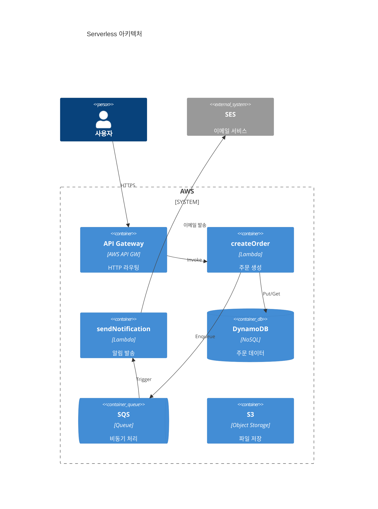

# 아키텍처 패턴 카탈로그

## 패턴 선택 매트릭스

| 패턴 | 적합한 상황 | 확장성 | 복잡도 | 팀 규모 |
|---|---|---|---|---|
| **Layered** | 전통적 비즈니스 앱, CRUD 중심 | 중 | 낮음 | 소~중 |
| **Microservices** | 대규모 팀, 독립 배포 필요 | 높음 | 높음 | 대 |
| **Event-Driven** | 비동기 처리, 느슨한 결합 | 높음 | 중~높 | 중~대 |
| **Hexagonal** | 테스트 용이성, 프레임워크 독립 | 중 | 중 | 소~중 |
| **Clean Architecture** | 복잡한 도메인 로직 | 중 | 중~높 | 중 |
| **CQRS** | 읽기/쓰기 비대칭, 이벤트 소싱 | 높음 | 높음 | 중~대 |
| **Serverless** | 이벤트 트리거, 비용 최적화 | 높음 | 중 | 소~중 |

---

## Layered (N-Tier)

**핵심 개념**: 관심사를 계층별로 분리. 각 계층은 바로 아래 계층만 의존한다.



**장점**: 단순함, 관심사 분리, 테스트 용이
**단점**: 모놀리식 경향, 계층 간 의존성, 수평 확장 제한

---

## Microservices

**핵심 개념**: 비즈니스 도메인별 독립 서비스. 각 서비스는 자체 DB를 소유한다.



**장점**: 독립 배포, 기술 스택 자유, 팀 자율성
**단점**: 분산 시스템 복잡도, 데이터 일관성, 운영 오버헤드

---

## Event-Driven

**핵심 개념**: 이벤트를 통한 느슨한 결합. Producer는 Consumer를 모른다.



**장점**: 느슨한 결합, 확장성, 비동기 처리
**단점**: 이벤트 순서 보장 어려움, 디버깅 복잡, 최종 일관성

---

## Hexagonal (Ports & Adapters)

**핵심 개념**: 도메인이 중심. 외부 세계와는 포트(인터페이스)와 어댑터로 연결한다.



**장점**: 테스트 용이, 프레임워크 독립, 의존성 역전
**단점**: 초기 설계 비용, 소규모 프로젝트에 과한 추상화

---

## Clean Architecture

**핵심 개념**: 의존성 규칙 - 바깥 계층이 안쪽을 의존하지, 안쪽은 바깥을 모른다.



**장점**: 도메인 중심, 테스트 용이, 변경에 강함
**단점**: 학습 곡선, 보일러플레이트, 소규모에 과도

---

## CQRS (Command Query Responsibility Segregation)

**핵심 개념**: 쓰기(Command)와 읽기(Query)를 분리하여 각각 최적화한다.



**장점**: 읽기/쓰기 독립 확장, 각 모델 최적화, 이벤트 소싱 연계
**단점**: 최종 일관성, 구현 복잡도, 동기화 지연

---

## Serverless / FaaS

**핵심 개념**: 인프라 관리 없이 함수 단위로 배포. 이벤트 트리거 기반.



**장점**: 인프라 관리 불필요, 자동 확장, 사용한 만큼 과금
**단점**: 콜드 스타트, 벤더 종속, 장기 실행 작업 제한

---

## ADR (Architecture Decision Record) 상세 템플릿

```markdown
# ADR-[번호]: [결정 제목]

**상태**: 제안됨 | 승인됨 | 폐기됨 | [ADR-XXX로 대체됨]
**날짜**: YYYY-MM-DD
**의사결정자**: [참여자 목록]

## 컨텍스트

[이 결정이 필요하게 된 배경, 기술적/비즈니스적 상황, 제약조건]

## 결정

[선택한 해결 방안을 구체적으로 기술]

## 근거

[이 방안을 선택한 이유. 핵심 논거와 데이터를 기반으로]

## 결과

### 긍정적
- [기대 효과 1]
- [기대 효과 2]

### 부정적 (트레이드오프)
- [감수해야 할 비용/리스크 1]
- [감수해야 할 비용/리스크 2]

### 중립적
- [변경이 필요하지만 긍정/부정이 아닌 영향]

## 검토한 대안

### 대안 1: [이름]
- 설명: [간략 설명]
- 미채택 사유: [구체적 이유]

### 대안 2: [이름]
- 설명: [간략 설명]
- 미채택 사유: [구체적 이유]

## 관련 ADR
- [ADR-XXX]: [관계 설명]
```

---

## 규모별 다이어그램 전략

### 단일 서비스

| 다이어그램 | 용도 |
|---|---|
| Class Diagram | 도메인 모델, 클래스 관계 |
| Sequence Diagram | 주요 API 흐름 |
| ER Diagram | DB 스키마 |
| State Diagram | 핵심 엔티티 상태 전이 |

### 멀티 서비스 시스템

| 다이어그램 | 용도 |
|---|---|
| C4 Context | 전체 시스템과 외부 연동 |
| C4 Container | 서비스 간 관계 |
| Sequence Diagram | 서비스 간 통신 흐름 |
| ER Diagram | 서비스별 DB 스키마 |

### 엔터프라이즈

| 다이어그램 | 용도 |
|---|---|
| C4 Context | 시스템 간 관계 (조감도) |
| C4 Container | 각 시스템 내부 구조 |
| C4 Component | 핵심 서비스 컴포넌트 |
| C4 Deployment | 인프라/배포 구성 |
| Flowchart | 비즈니스 프로세스 |
| State Diagram | 핵심 워크플로우 상태 |
