# Mermaid 다이어그램 전체 레퍼런스

## 목차

- [Architecture Diagram](#architecture-diagram)
- [Block Diagram](#block-diagram)
- [C4 Diagrams](#c4-diagrams)
- [Class Diagram](#class-diagram)
- [ER Diagram](#er-diagram)
- [Flowchart](#flowchart)
- [Gantt Chart](#gantt-chart)
- [Git Graph](#git-graph)
- [Kanban](#kanban)
- [Mindmap](#mindmap)
- [Packet Diagram](#packet-diagram)
- [Pie Chart](#pie-chart)
- [Quadrant Chart](#quadrant-chart)
- [Sankey Diagram](#sankey-diagram)
- [Sequence Diagram](#sequence-diagram)
- [State Diagram](#state-diagram)
- [Timeline](#timeline)
- [XY Chart](#xy-chart)
- [ZenUML](#zenuml)

---

## Architecture Diagram

인프라 아키텍처를 시각적으로 표현한다.

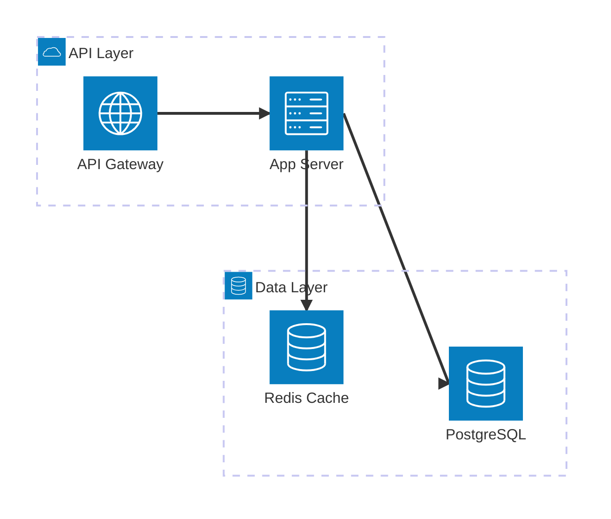
```mermaid
architecture-beta
    group api(cloud)[API Layer]
    group db(database)[Data Layer]

    service gateway(internet)[API Gateway] in api
    service app(server)[App Server] in api
    service postgres(database)[PostgreSQL] in db
    service redis(database)[Redis Cache] in db

    gateway:R --> L:app
    app:R --> L:postgres
    app:B --> T:redis
```

방향: `T`(위), `B`(아래), `L`(왼), `R`(오)
그룹 아이콘: `cloud`, `database`, `server`, `disk`, `internet`

## Block Diagram

그리드 기반 블록 레이아웃을 표현한다.

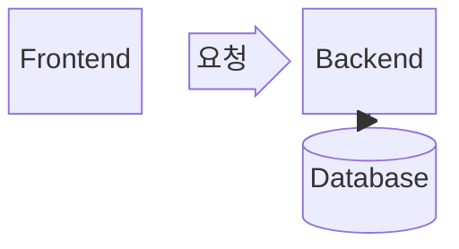
```mermaid
block-beta
    columns 3
    Frontend blockArrowId<["요청"]>(right) Backend
    space:2 DB[("Database")]
    Backend --> DB
```

레이아웃: `columns N`으로 열 수 지정
요소: `blockArrowId<["라벨"]>(방향)`, `space`로 빈 칸

## C4 Diagrams

### C4 Context (시스템 컨텍스트)

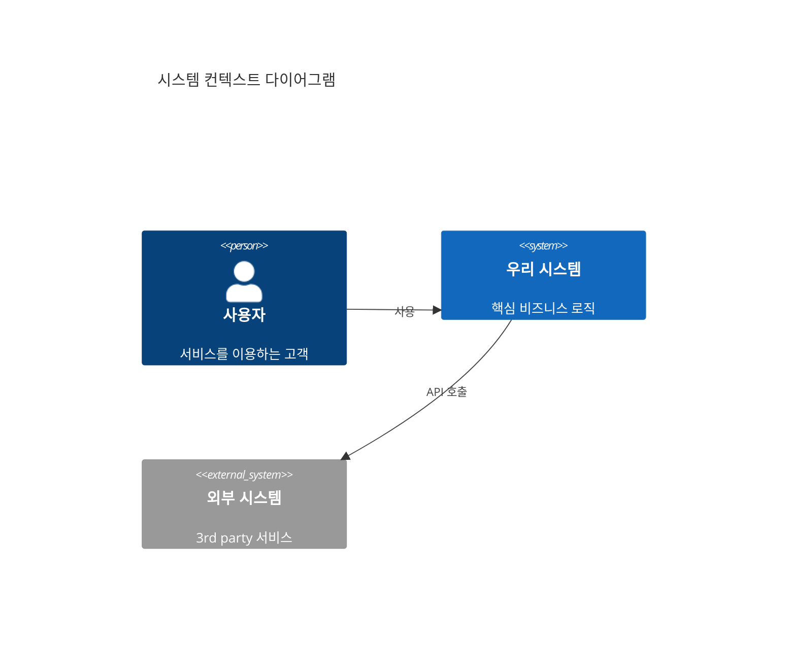
```mermaid
C4Context
    title 시스템 컨텍스트 다이어그램

    Person(user, "사용자", "서비스를 이용하는 고객")
    System(system, "우리 시스템", "핵심 비즈니스 로직")
    System_Ext(ext, "외부 시스템", "3rd party 서비스")

    Rel(user, system, "사용")
    Rel(system, ext, "API 호출")
```

### C4 Container (컨테이너)

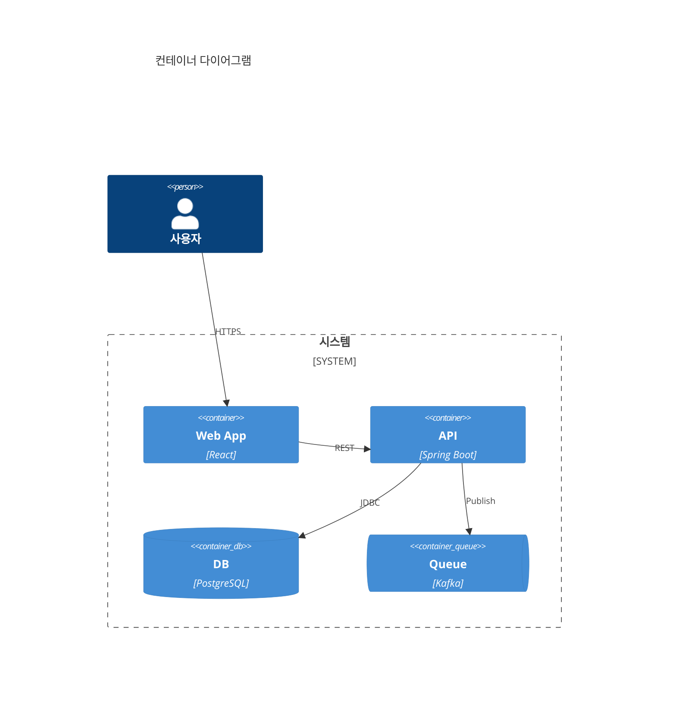
```mermaid
C4Container
    title 컨테이너 다이어그램

    Person(user, "사용자")

    System_Boundary(sys, "시스템") {
        Container(web, "Web App", "React")
        Container(api, "API", "Spring Boot")
        ContainerDb(db, "DB", "PostgreSQL")
        ContainerQueue(queue, "Queue", "Kafka")
    }

    Rel(user, web, "HTTPS")
    Rel(web, api, "REST")
    Rel(api, db, "JDBC")
    Rel(api, queue, "Publish")
```

### C4 Component (컴포넌트)

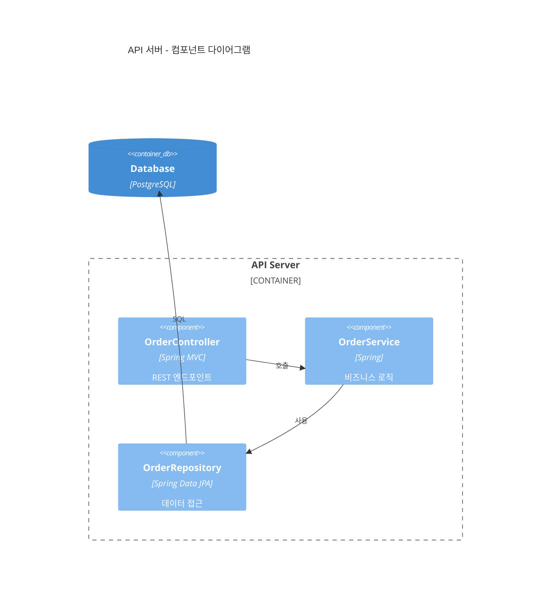
```mermaid
C4Component
    title API 서버 - 컴포넌트 다이어그램

    Container_Boundary(api, "API Server") {
        Component(controller, "OrderController", "Spring MVC", "REST 엔드포인트")
        Component(service, "OrderService", "Spring", "비즈니스 로직")
        Component(repo, "OrderRepository", "Spring Data JPA", "데이터 접근")
    }

    ContainerDb(db, "Database", "PostgreSQL")

    Rel(controller, service, "호출")
    Rel(service, repo, "사용")
    Rel(repo, db, "SQL")
```

### C4 Dynamic (동적 흐름)

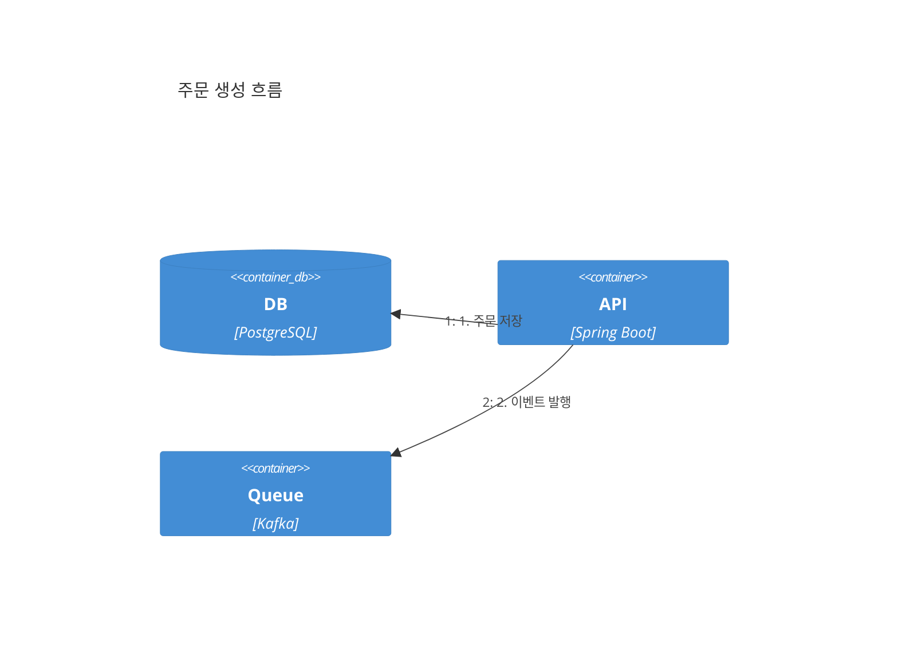
```mermaid
C4Dynamic
    title 주문 생성 흐름

    ContainerDb(db, "DB", "PostgreSQL")
    Container(api, "API", "Spring Boot")
    Container(queue, "Queue", "Kafka")

    Rel(api, db, "1. 주문 저장")
    Rel(api, queue, "2. 이벤트 발행")
```

### C4 Deployment (배포)

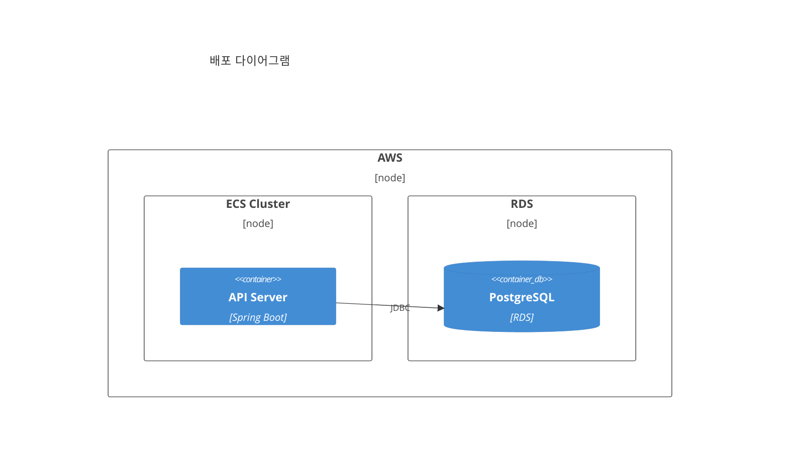
```mermaid
C4Deployment
    title 배포 다이어그램

    Deployment_Node(aws, "AWS") {
        Deployment_Node(ecs, "ECS Cluster") {
            Container(api, "API Server", "Spring Boot")
        }
        Deployment_Node(rds, "RDS") {
            ContainerDb(db, "PostgreSQL", "RDS")
        }
    }

    Rel(api, db, "JDBC")
```

C4 요소 전체: `Person()`, `Person_Ext()`, `System()`, `System_Ext()`, `System_Boundary()`, `Container()`, `ContainerDb()`, `ContainerQueue()`, `Container_Boundary()`, `Component()`, `Deployment_Node()`, `Rel()`, `BiRel()`, `UpdateRelStyle()`

## Class Diagram

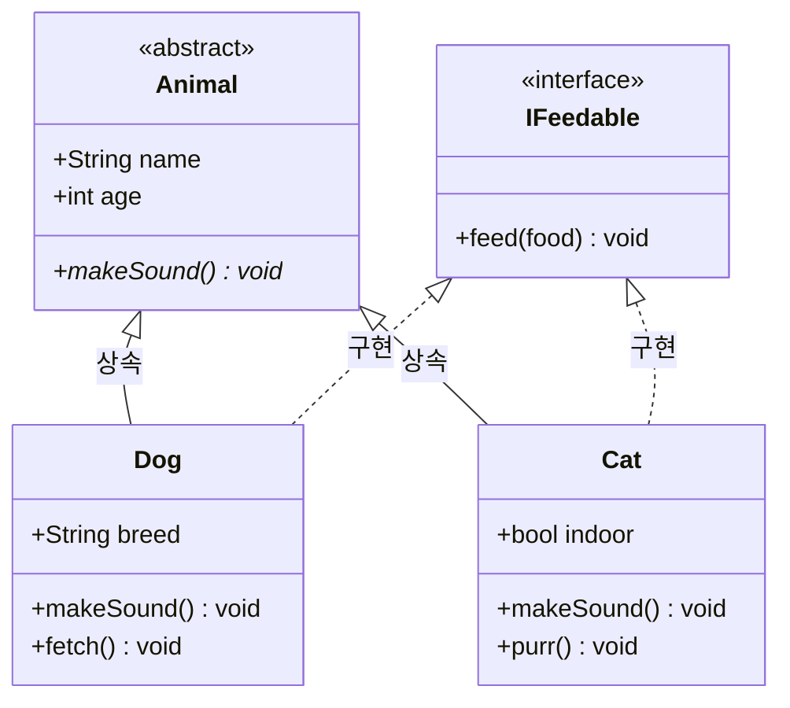
```mermaid
classDiagram
    class Animal {
        <<abstract>>
        +String name
        +int age
        +makeSound()* void
    }

    class Dog {
        +String breed
        +makeSound() void
        +fetch() void
    }

    class Cat {
        +bool indoor
        +makeSound() void
        +purr() void
    }

    class IFeedable {
        <<interface>>
        +feed(food) void
    }

    Animal <|-- Dog : 상속
    Animal <|-- Cat : 상속
    IFeedable <|.. Dog : 구현
    IFeedable <|.. Cat : 구현
```

관계 타입:
| 기호 | 의미 | 설명 |
|---|---|---|
| `<\|--` | 상속 (Inheritance) | 실선 + 빈 삼각형 |
| `<\|..` | 구현 (Realization) | 점선 + 빈 삼각형 |
| `*--` | 컴포지션 (Composition) | 실선 + 채운 다이아몬드 |
| `o--` | 집합 (Aggregation) | 실선 + 빈 다이아몬드 |
| `-->` | 연관 (Association) | 실선 화살표 |
| `..>` | 의존 (Dependency) | 점선 화살표 |
| `--` | 링크 (Link) | 실선 |

접근 제어: `+` public, `-` private, `#` protected, `~` package
카디널리티: `"1" --> "*"` 와 같이 표기
제네릭: `List~Type~` 형식 (꺾쇠 대신 물결)

## ER Diagram

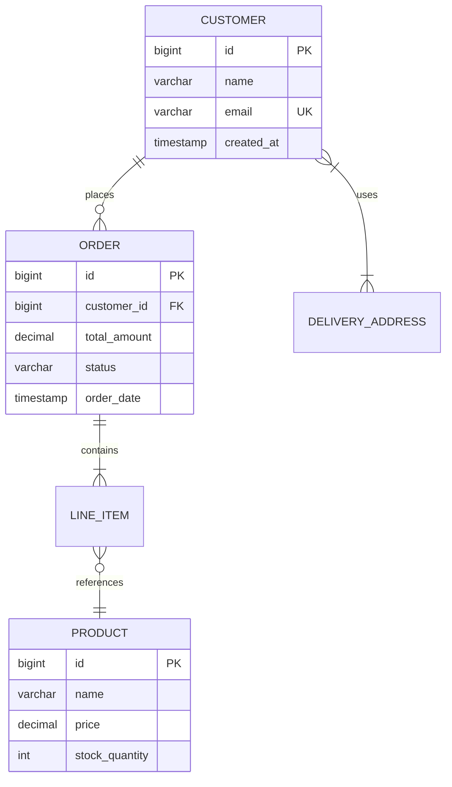
```mermaid
erDiagram
    CUSTOMER ||--o{ ORDER : places
    ORDER ||--|{ LINE_ITEM : contains
    LINE_ITEM }o--|| PRODUCT : "references"
    CUSTOMER }|--|{ DELIVERY_ADDRESS : uses

    CUSTOMER {
        bigint id PK
        varchar name
        varchar email UK
        timestamp created_at
    }

    ORDER {
        bigint id PK
        bigint customer_id FK
        decimal total_amount
        varchar status
        timestamp order_date
    }

    PRODUCT {
        bigint id PK
        varchar name
        decimal price
        int stock_quantity
    }
```

카디널리티 기호:
| 기호 | 의미 |
|---|---|
| `\|\|` | 정확히 하나 |
| `o\|` | 0 또는 하나 |
| `\|}` | 하나 이상 |
| `o{` | 0 이상 |

속성 표기: `타입 이름 제약조건` (PK, FK, UK)

## Flowchart

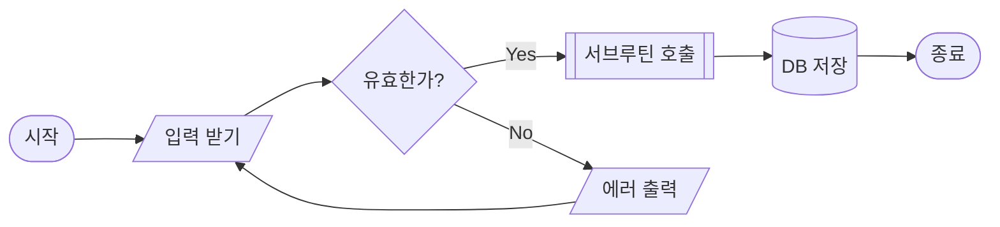
```mermaid
flowchart LR
    A([시작]) --> B[/입력 받기/]
    B --> C{유효한가?}
    C -->|Yes| D[[서브루틴 호출]]
    C -->|No| E[/에러 출력/]
    E --> B
    D --> F[(DB 저장)]
    F --> G([종료])
```

노드 형태:
| 문법 | 형태 |
|---|---|
| `[텍스트]` | 사각형 |
| `(텍스트)` | 둥근 사각형 |
| `([텍스트])` | 스타디움 |
| `{텍스트}` | 다이아몬드 |
| `((텍스트))` | 원 |
| `[(텍스트)]` | 원통형 (DB) |
| `[[텍스트]]` | 서브루틴 |
| `[/텍스트/]` | 평행사변형 (입출력) |
| `{{텍스트}}` | 육각형 |
| `>텍스트]` | 비대칭 |

화살표:
| 문법 | 의미 |
|---|---|
| `-->` | 실선 화살표 |
| `-.->` | 점선 화살표 |
| `==>` | 굵은 화살표 |
| `--텍스트-->` | 라벨 있는 화살표 |
| `-->\|텍스트\|` | 라벨 있는 화살표 (대안) |

서브그래프:
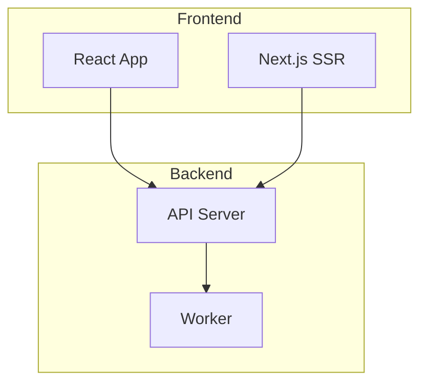
```mermaid
flowchart TB
    subgraph Frontend
        A[React App]
        B[Next.js SSR]
    end
    subgraph Backend
        C[API Server]
        D[Worker]
    end
    A --> C
    B --> C
    C --> D
```

## Gantt Chart

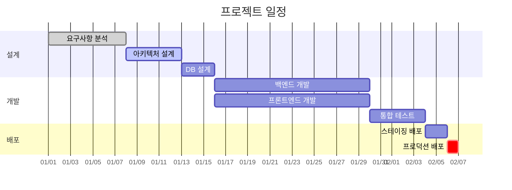
```mermaid
gantt
    title 프로젝트 일정
    dateFormat YYYY-MM-DD
    axisFormat %m/%d

    section 설계
        요구사항 분석     :done,    des1, 2025-01-01, 7d
        아키텍처 설계     :active,  des2, after des1, 5d
        DB 설계           :         des3, after des2, 3d

    section 개발
        백엔드 개발       :         dev1, after des3, 14d
        프론트엔드 개발   :         dev2, after des3, 14d
        통합 테스트       :         dev3, after dev1, 5d

    section 배포
        스테이징 배포     :         dep1, after dev3, 2d
        프로덕션 배포     :crit,    dep2, after dep1, 1d
```

상태: `done`(완료), `active`(진행중), `crit`(중요), 미지정(예정)
기간: `7d`, `2025-01-01, 2025-01-07`, `after taskId, 5d`

## Git Graph

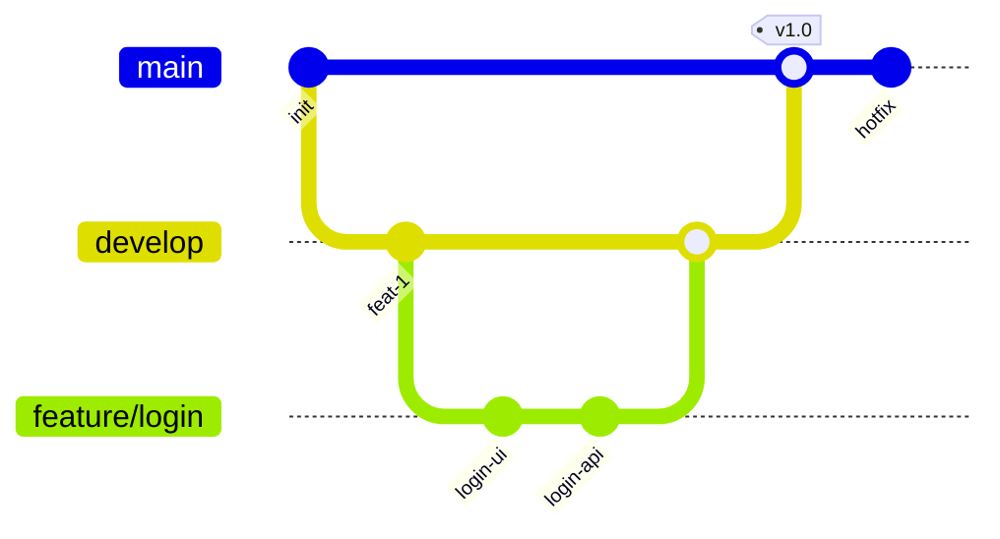
```mermaid
gitGraph
    commit id: "init"
    branch develop
    checkout develop
    commit id: "feat-1"
    branch feature/login
    checkout feature/login
    commit id: "login-ui"
    commit id: "login-api"
    checkout develop
    merge feature/login
    checkout main
    merge develop tag: "v1.0"
    commit id: "hotfix"
```

명령어: `commit`, `branch`, `checkout`, `merge`, `cherry-pick`
옵션: `id: "메시지"`, `tag: "태그"`, `type: HIGHLIGHT`

## Kanban

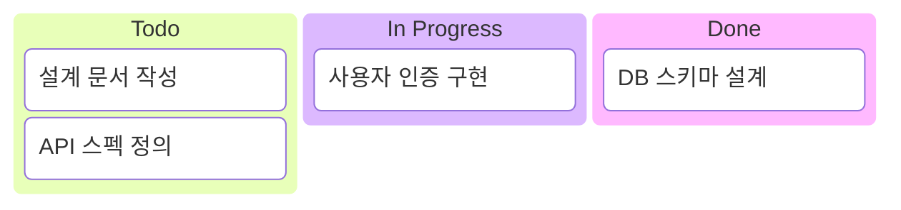
```mermaid
kanban
    column1[Todo]
        task1[설계 문서 작성]
        task2[API 스펙 정의]
    column2[In Progress]
        task3[사용자 인증 구현]
    column3[Done]
        task4[DB 스키마 설계]
```

## Mindmap

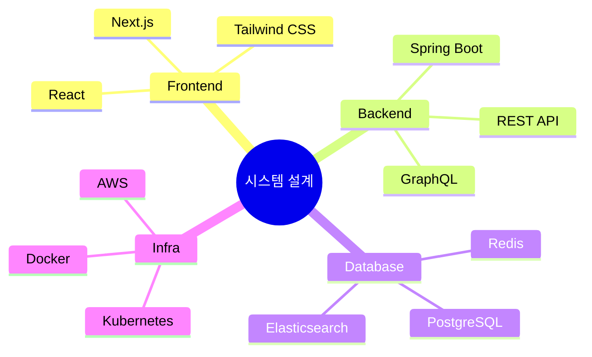
```mermaid
mindmap
    root((시스템 설계))
        Frontend
            React
            Next.js
            Tailwind CSS
        Backend
            Spring Boot
            REST API
            GraphQL
        Database
            PostgreSQL
            Redis
            Elasticsearch
        Infra
            AWS
            Docker
            Kubernetes
```

노드 형태: `(())` 원, `()` 둥근, `[]` 사각형, `))` 배너, `{{}}` 육각형

## Packet Diagram

네트워크 패킷 구조를 표현한다.

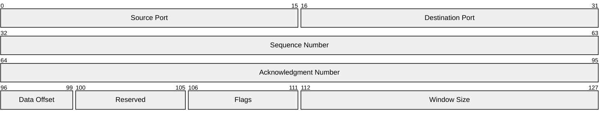
```mermaid
packet-beta
    0-15: "Source Port"
    16-31: "Destination Port"
    32-63: "Sequence Number"
    64-95: "Acknowledgment Number"
    96-99: "Data Offset"
    100-105: "Reserved"
    106-111: "Flags"
    112-127: "Window Size"
```

## Pie Chart

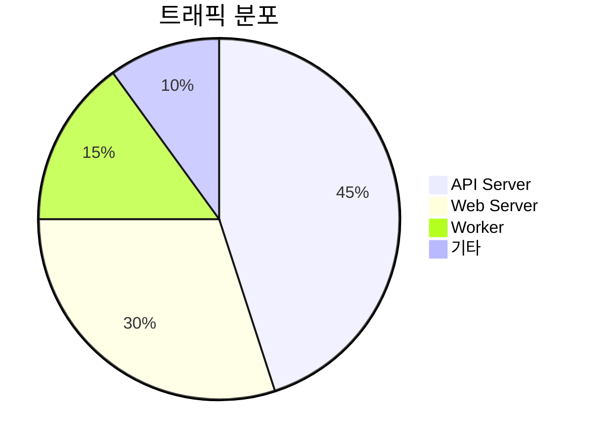
```mermaid
pie title 트래픽 분포
    "API Server" : 45
    "Web Server" : 30
    "Worker" : 15
    "기타" : 10
```

## Quadrant Chart

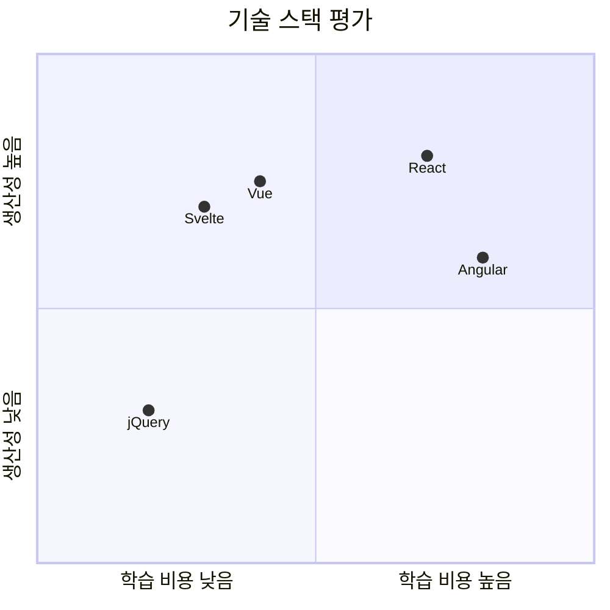
```mermaid
quadrantChart
    title 기술 스택 평가
    x-axis "학습 비용 낮음" --> "학습 비용 높음"
    y-axis "생산성 낮음" --> "생산성 높음"

    React: [0.7, 0.8]
    Vue: [0.4, 0.75]
    Angular: [0.8, 0.6]
    Svelte: [0.3, 0.7]
    jQuery: [0.2, 0.3]
```

## Sankey Diagram

데이터 흐름의 양을 시각화한다.

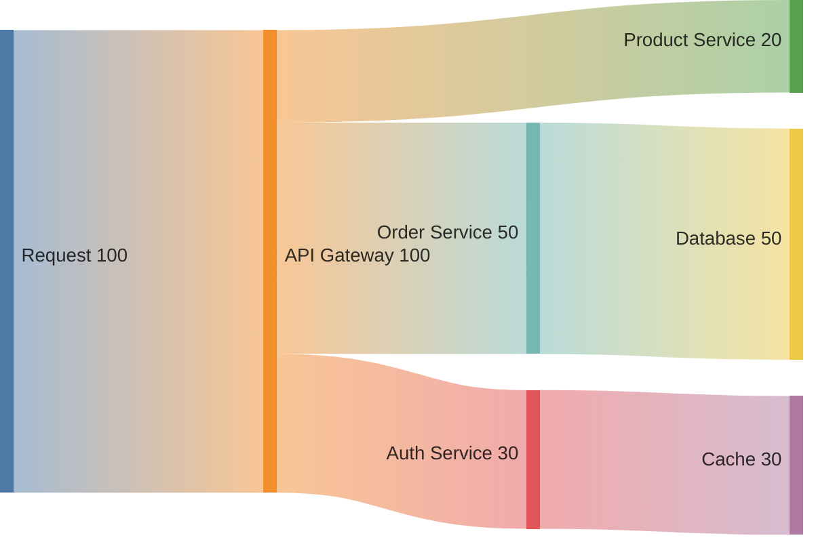
```mermaid
sankey-beta
    Request,API Gateway,100
    API Gateway,Auth Service,30
    API Gateway,Order Service,50
    API Gateway,Product Service,20
    Order Service,Database,50
    Auth Service,Cache,30
```

## Sequence Diagram

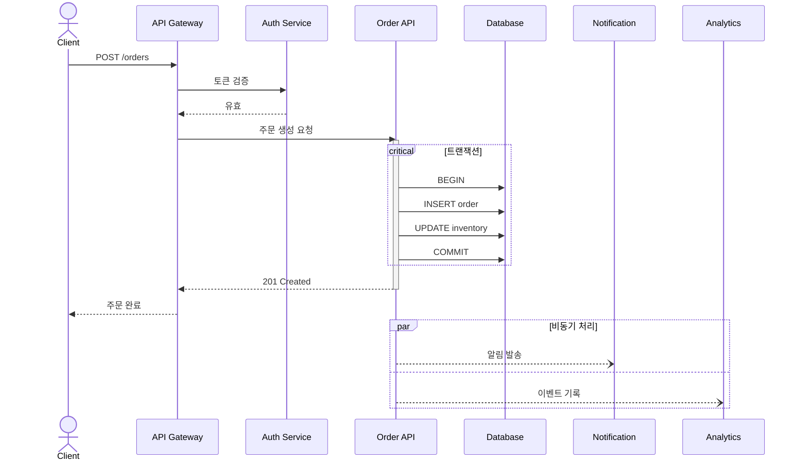
```mermaid
sequenceDiagram
    actor Client
    participant GW as API Gateway
    participant Auth as Auth Service
    participant API as Order API
    participant DB as Database

    Client->>GW: POST /orders
    GW->>Auth: 토큰 검증
    Auth-->>GW: 유효

    GW->>API: 주문 생성 요청
    activate API

    critical 트랜잭션
        API->>DB: BEGIN
        API->>DB: INSERT order
        API->>DB: UPDATE inventory
        API->>DB: COMMIT
    end

    API-->>GW: 201 Created
    deactivate API
    GW-->>Client: 주문 완료

    par 비동기 처리
        API--)Notification: 알림 발송
    and
        API--)Analytics: 이벤트 기록
    end
```

메시지 타입:
| 기호 | 의미 |
|---|---|
| `->>` | 동기 요청 (실선) |
| `-->>` | 동기 응답 (점선) |
| `--)` | 비동기 메시지 (실선, 열린 화살표) |
| `--)`  | 비동기 응답 (점선, 열린 화살표) |
| `-x` | 실패/종료 (실선, X) |
| `--x` | 실패/종료 (점선, X) |

블록: `alt/else/end`, `opt/end`, `loop/end`, `par/and/end`, `critical/option/end`, `break/end`, `rect rgb()/end`
노트: `note over A,B: 텍스트`, `note left of A: 텍스트`, `note right of A: 텍스트`
활성화: `activate/deactivate` 또는 `+`/`-` 접미사

## State Diagram

```mermaid
stateDiagram-v2
    [*] --> Idle

    Idle --> Processing : 요청 수신
    Processing --> Success : 처리 완료
    Processing --> Failed : 에러 발생

    Success --> [*]
    Failed --> Retry : 재시도 가능
    Failed --> [*] : 재시도 불가

    Retry --> Processing : 재처리

    state Processing {
        [*] --> Validating
        Validating --> Executing : 검증 통과
        Validating --> [*] : 검증 실패
        Executing --> [*]
    }

    state choice_state <<choice>>
    Processing --> choice_state
    choice_state --> Success : 성공
    choice_state --> Failed : 실패

    note right of Processing
        최대 3회 재시도
        지수 백오프 적용
    end note
```

특수 상태: `[*]` 시작/종료, `<<choice>>` 분기, `<<fork>>` 포크, `<<join>>` 조인
중첩 상태: `state 이름 { ... }`
노트: `note left/right of 상태`
동시성: `state 이름 { --  }` (구분선으로 병렬 영역)

## Timeline

```mermaid
timeline
    title 프로젝트 마일스톤
    section Q1 2025
        1월 : 요구사항 분석
            : 기술 스택 선정
        2월 : 아키텍처 설계
            : DB 스키마 설계
        3월 : MVP 개발
    section Q2 2025
        4월 : 알파 테스트
        5월 : 베타 출시
        6월 : 정식 출시
```

## XY Chart

```mermaid
xychart-beta
    title "월별 API 응답 시간 (ms)"
    x-axis [1월, 2월, 3월, 4월, 5월, 6월]
    y-axis "응답 시간 (ms)" 0 --> 500
    bar [120, 150, 130, 200, 180, 160]
    line [120, 150, 130, 200, 180, 160]
```

차트 유형: `bar`(막대), `line`(선) 혼합 가능

## ZenUML

시퀀스 다이어그램의 코드 스타일 대안이다.

```mermaid
zenuml
    @Actor Client
    @Boundary API
    @Database DB

    Client->API.createOrder() {
        API->DB.save(order) {
            return orderId
        }
        return 201
    }
```
