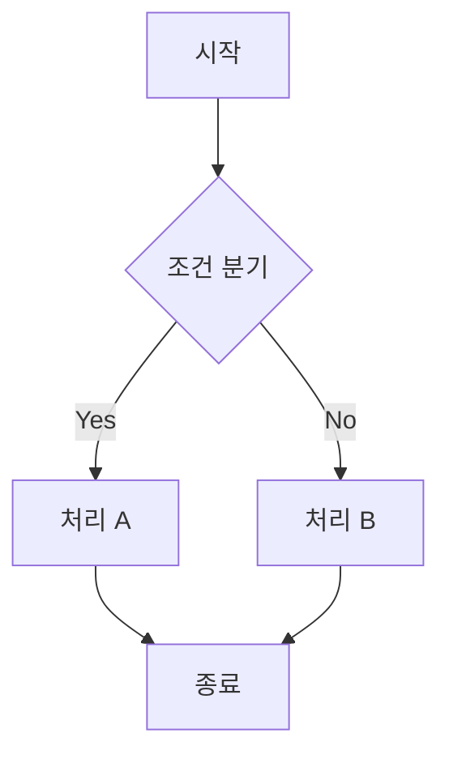
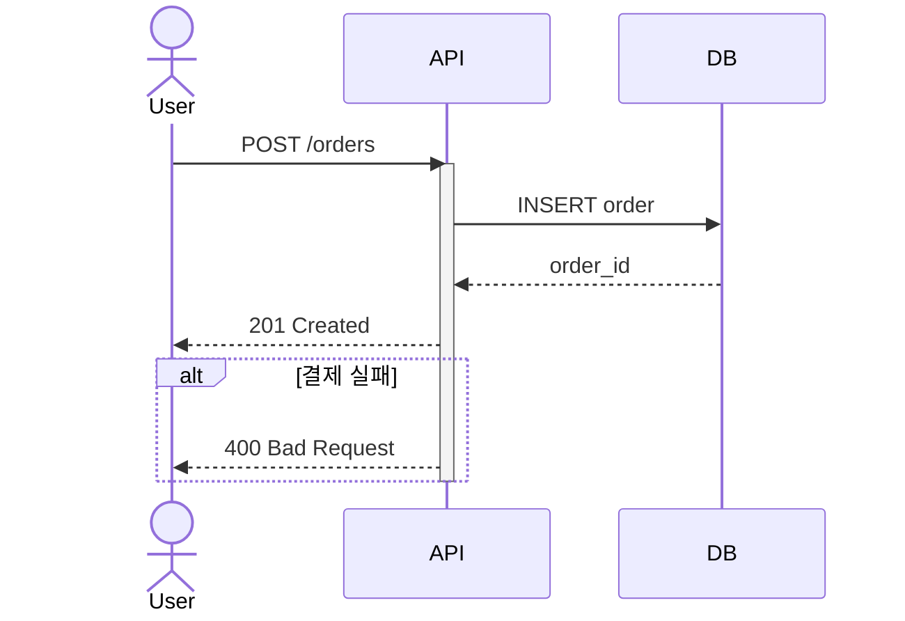
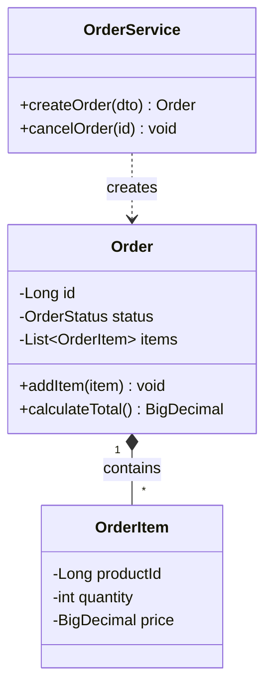
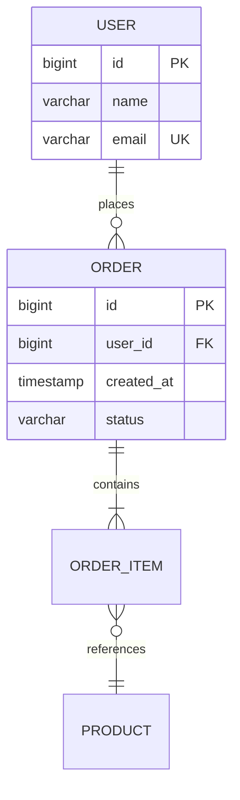
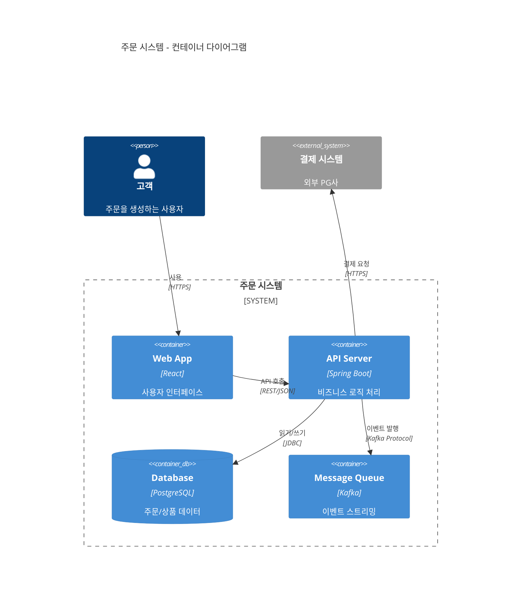
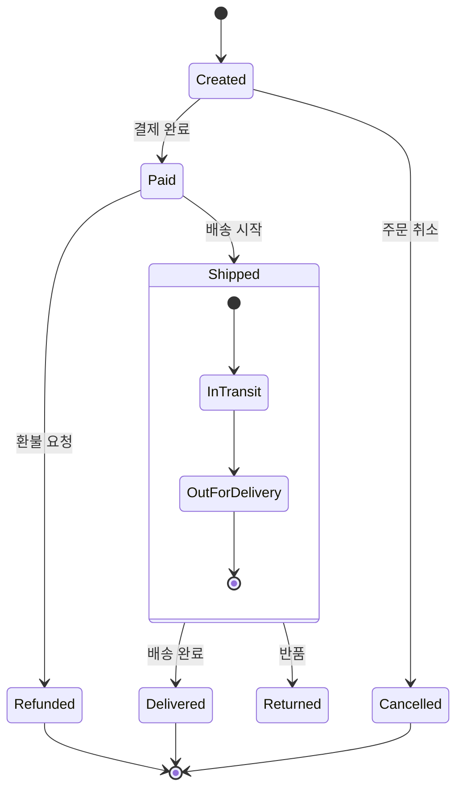

# 소프트웨어 아키텍처 설계 & Mermaid 다이어그램

## 아키텍처 설계 워크플로우

```
진행 상황:
- [ ] 1단계: 요구사항 파악 (기능/비기능/제약조건)
- [ ] 2단계: 아키텍처 드라이버 식별 (확장성, 보안, 비용 등)
- [ ] 3단계: 아키텍처 패턴 선택 → [ARCHITECTURE_PATTERNS.md](ARCHITECTURE_PATTERNS.md) 참조
- [ ] 4단계: 컴포넌트 경계 및 인터페이스 정의
- [ ] 5단계: 다이어그램 작성 (아래 가이드 참조)
- [ ] 6단계: ADR(Architecture Decision Record) 문서화
- [ ] 7단계: 요구사항 대비 검증
```

## 다이어그램 선택 가이드

| 표현하고 싶은 것 | 다이어그램 타입 | 키워드 |
|---|---|---|
| 프로세스 흐름 / 분기 로직 | `flowchart` | TD, LR |
| API/서비스 호출 순서 | `sequenceDiagram` | ->>, -->> |
| 클래스/객체 관계 | `classDiagram` | <\|--, *--, o-- |
| DB 테이블 관계 | `erDiagram` | \|\|--o{ |
| 시스템 전체 구조 (C4) | `C4Context` / `C4Container` | Person, System, Container |
| 상태 전이 / 라이프사이클 | `stateDiagram-v2` | --> |
| 프로젝트 일정 | `gantt` | section, task |
| 브레인스토밍 / 개념 정리 | `mindmap` | root, :: |
| 비율 / 분포 | `pie` | title |
| 연대표 / 이력 | `timeline` | title, section |
| **기타** | [DIAGRAM_REFERENCE.md](DIAGRAM_REFERENCE.md) 참조 | |

## 핵심 다이어그램 Quick Syntax

### Flowchart



방향: `TD`(위→아래), `LR`(왼→오), `BT`(아래→위), `RL`(오→왼)
노드: `[]` 사각형, `()` 둥근, `{}` 다이아몬드, `[()]` 원통형, `(())` 원

### Sequence Diagram



화살표: `->>` 실선, `-->>` 점선, `-x` 비동기
블록: `alt/else/end`, `loop/end`, `par/and/end`, `opt/end`, `critical/end`

### Class Diagram



관계: `<|--` 상속, `*--` 컴포지션, `o--` 집합, `-->` 연관, `..>` 의존, `..|>` 구현

### ER Diagram



카디널리티: `||--||` 1:1, `||--o{` 1:N, `}o--o{` M:N
표기: `PK` 기본키, `FK` 외래키, `UK` 유니크

### C4 Container Diagram



C4 레벨: `C4Context`(시스템 컨텍스트), `C4Container`(컨테이너), `C4Component`(컴포넌트), `C4Deployment`(배포)
요소: `Person()`, `System()`, `System_Ext()`, `Container()`, `ContainerDb()`, `Component()`

### State Diagram



## ADR 간이 템플릿

```markdown
# ADR-001: [결정 제목]

**상태**: 제안됨 | 승인됨 | 폐기됨 | 대체됨
**날짜**: YYYY-MM-DD

## 컨텍스트
[이 결정이 필요한 배경과 문제 상황]

## 결정
[선택한 해결 방안]

## 근거
[이 방안을 선택한 이유]

## 결과
- 긍정적: [기대 효과]
- 부정적: [트레이드오프]

## 검토한 대안
1. [대안 A] - 미채택 사유: [...]
2. [대안 B] - 미채택 사유: [...]
```

## 추가 리소스

- **전체 다이어그램 문법**: [DIAGRAM_REFERENCE.md](DIAGRAM_REFERENCE.md)
- **아키텍처 패턴 카탈로그**: [ARCHITECTURE_PATTERNS.md](ARCHITECTURE_PATTERNS.md)
- **고급 다이어그램 기법**: [ADVANCED_DIAGRAMS.md](ADVANCED_DIAGRAMS.md)

## 주의사항

- 노드 ID에 특수문자 사용 금지 (영숫자 + 언더스코어)
- 괄호/대괄호가 포함된 라벨은 `""`로 감싸기
- C4 다이어그램은 반드시 `C4Context`, `C4Container` 등 접두사로 시작
- ER 다이어그램 관계는 `||--o{` 형식 (UML 화살표 아님)
- Mermaid Live Editor(https://mermaid.live/)에서 렌더링 확인 가능
